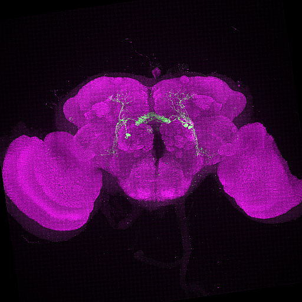

<!-- README.md is generated from README.Rmd. Please edit that file -->

```{r, include = FALSE}
knitr::opts_chunk$set(
  collapse = TRUE,
  comment = "#>"
)
```

# nat-tech

<!-- badges: start -->
[](https://www.tidyverse.org/lifecycle/#experimental)
<!-- badges: end -->

The goal of `nat-tech` is to provide R client utilities for streamlining registration of light-level microscopy data to existing [template brains](https://www.janelia.org/open-science/jrc-2018-brain-templates) for for *D. melanogaster* neurons. It is a set of R scripts that enable a user to register raw light miscroscopy data, and create .nrrd files of the final registered product alongside hemibrain neuron reconstructions. Our main use case is in running a splitGAL4 line screen; we want to see whether the potential hits in our screen co-localise with the specified hemibrain neuronal cell types we are trying to target. This tool utilizes the [Computational Morphometry Toolkit (CMTK)](https://www.nitrc.org/projects/cmtk/) to write CMTK registration commands. 

# Data sets
The major EM dataset at the time when this package was built was the [hemibrain connectome](https://www.janelia.org/project-team/flyem/hemibrain). Connectome data can be seen using the 
[neuPrint website](https://neuprint.janelia.org/help/videos?dataset=hemibrain) and accessed programmatically in R using [neuprintr](https://github.com/natverse/neuprintr). This tool also will help you co-visualize the registered data to the corresponding neuron in the hemibrain connectome. The user must specifcy what cell type they want included in the hemibrain .nrrd file. 

# How have these registrations been performed? 
In the past, light-level microscopy data could be registrated using the [fiji-cmtk-gui](https://github.com/jefferis/fiji-cmtk-gui). This tool automates this process more without having to open the GUI and also adds functionality by co-plotting these neurons with connectome date. 

In the following, we detail some of `nat-tech`'s functionality 

# Useful Functions
```{r funct, echo = TRUE, eval = FALSE, include = TRUE}
#takes a .nrrd file and plots it with its counterpart in hemibrain connectome
nrrd_to_hemibrain()

#converts a .swc neuron trace and plots it with its counterpart in hemibrain connectome
neuron_to_hemibrain()

#converts a hemibrain neuron into a .nrrd file (to compare to a light-level image image)
hemibrain_to_nrrd()

#converts a flywire neuron into a .nrrd file (to compare to a light-level image image)
flywireid_to_nrrd()

#writes the cmtk registration command based on the Registration file location
write_cmtkreg()

```

# To run the pipeline

Install CMTK GUI in FIJI according to the directions on the [github page](https://github.com/jefferis/fiji-cmtk-gui) and the correct registration [folder structure](http://flybrain.mrc-lmb.cam.ac.uk/dokuwiki/doku.php?id=warping_manual:registration_gui) outlined here.

Then, take a raw light-level image z-stack like this 



And save the 2 or 3 channel image as  a .tif file in the correct folder. It is recommended that you also set up a cron job on your machine to run as often as you want so you don't have to run the code manually. You must hard code the folder paths so the code knows where to find all of your files as well. Adjustment to the number of cores used by the registration can also be edited in the write_cmtkreg function  in the line below. 

```{r cmtkreg, echo = TRUE, eval = FALSE, include = TRUE}

sprintf(\"/Applications/Fiji.app/bin/cmtk/munger\" -b \"/Applications/Fiji.app/bin/cmtk\" -a -w -r 0102  -X 26 -C 8 -G 80 -R 4 -A \"--accuracy 0.4\" -W \"--accuracy 0.4\"  -T 4 -s \"Refbrain/%s\" images/%s", template_path, folder)

```

That's all! Below is code to run the pipeline in the terminal
```{r cline, echo = TRUE, eval = FALSE, include = TRUE}

$ Rscript /Users/[user]/Documents/GitHub/nat-tech/R/pipeline.R

```


# Acknowledgements

This package was created by Emily Kellogg and [Alexander Shakeel Bates](https://scholar.google.com/citations?user=BOVTiXIAAAAJ&hl=en) while in the group of [Dr. Rachel Wilson](https://en.wikipedia.org/wiki/Rachel_Wilson_(neurobiologist)). 

**Kellogg E and Bates AS** (2022). *nat-tech* **R project** version 0.1.0. https://github.com/wilson-lab/nat-tech

# References
* **The hemibrain connectome (hemibrain:v1.2.1)**: Scheffer, L.K., Xu, C.S., Januszewski, M., Lu, Z., Takemura, S.-Y., Hayworth, K.J., Huang, G.B., Shinomiya, K., Maitlin-Shepard, J., Berg, S., et al. (2020). A connectome and analysis of the adult *Drosophila* central brain. Elife 9. [doi: https://doi.org/10.7554/eLife.57443]( https://doi.org/10.7554/eLife.57443)

* **JRC2018F brain and VNC templates**: Bogovic, J.A., Otsuna, H., Heinrich, L., Ito, M., Jeter, J., Meissner, G.W., Nern, A., Colonell, J., Malkesman, O., Ito, K., et al. (2018). An unbiased template of the Drosophila brain and ventral nerve cord. bioRxiv. [doi: https://doi.org/10.1101/376384](https://doi.org/10.1101/376384)