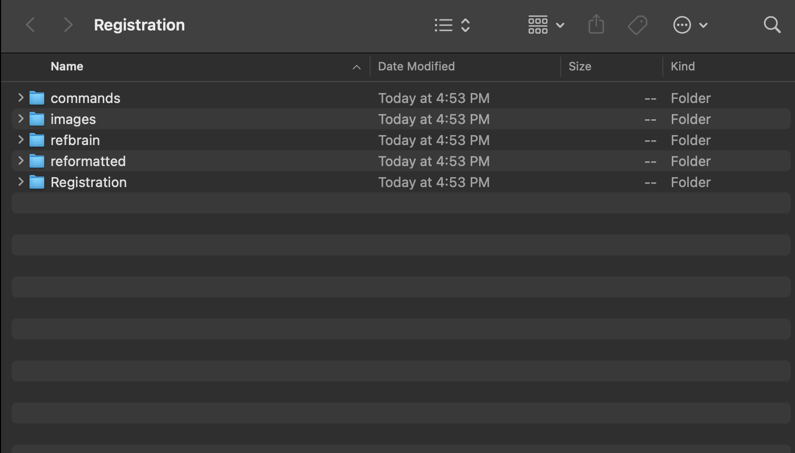
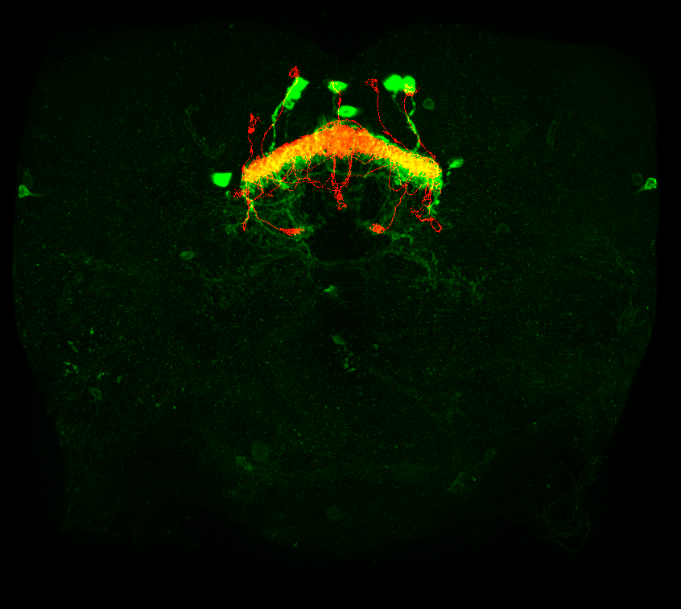

<!-- README.md is generated from README.Rmd. Please edit that file -->

```{r, include = FALSE}
knitr::opts_chunk$set(
  collapse = TRUE,
  comment = "#>"
)
```

# nat-tech

<!-- badges: start -->
[](https://www.tidyverse.org/lifecycle/#experimental)
<!-- badges: end -->

The goal of `nat-tech` is to provide R client utilities for streamlining registration of light-level microscopy data to existing [template brains](https://www.janelia.org/open-science/jrc-2018-brain-templates) for for *D. melanogaster* neurons. It is a set of R scripts that enable a user to register raw light miscroscopy data, and create .nrrd files of the final registered product alongside hemibrain neuron reconstructions. Our main use case is in running a splitGAL4 line screen; we want to see whether the potential hits in our screen co-localise with the specified hemibrain neuronal cell types we are trying to target. This tool utilizes the [Computational Morphometry Toolkit (CMTK)](https://www.nitrc.org/projects/cmtk/) to write CMTK registration commands. Below is a graphic detailing how this tool works and the expected output.


# Data sets
The major EM dataset at the time when this package was built was the [hemibrain connectome](https://www.janelia.org/project-team/flyem/hemibrain). Connectome data can be seen using the 
[neuPrint website](https://neuprint.janelia.org/help/videos?dataset=hemibrain) and accessed programmatically in R using [neuprintr](https://github.com/natverse/neuprintr). This tool also will help you co-visualize the registered data to the corresponding neuron in the hemibrain connectome. The user must specifcy what cell type they want included in the hemibrain .nrrd file. 

# How have these registrations been performed? 
In the past, light-level microscopy data could be registrated using the [fiji-cmtk-gui](https://github.com/jefferis/fiji-cmtk-gui). This tool automates this process more without having to open the GUI and also adds functionality by co-plotting these neurons with connectome date. 

In the following, we detail some of `nat-tech`'s functionality 

# Useful Functions
```{r funct, echo = TRUE, eval = FALSE, include = TRUE}
#takes a .nrrd file and plots it with its counterpart in hemibrain connectome
nrrd_to_hemibrain()

#converts a .swc neuron trace and plots it with its counterpart in hemibrain connectome
neuron_to_hemibrain()

#converts a hemibrain neuron into a .nrrd file (to compare to a light-level image image)
hemibrain_to_nrrd()

#converts a flywire neuron into a .nrrd file (to compare to a light-level image image)
flywireid_to_nrrd()

#writes the cmtk registration command based on the Registration file location
write_cmtkreg()

```

# To run the pipeline
First, install the CMTK gui in FIJI according to the directions on the github page [github page](https://github.com/jefferis/fiji-cmtk-gui) and the correct registration [folder structure](http://flybrain.mrc-lmb.cam.ac.uk/dokuwiki/doku.php?id=warping_manual:registration_gui) outlined here and below.

```{r, echo=FALSE, out.width="50%", out.height="50%"}

```

Second, go to the parameter.R scripts. Edit the variables to folders on your local machine
```{r rename, echo = TRUE, eval = FALSE, include = TRUE}
#this folder is where all of your registration files are, commonly on the desktop
registration_folder = "~/Desktop/Registration"

#this folder is the path where your unprocessed and processed .tif files will be 
data_folder = "~/Desktop/to_register"
raw_data = file.path(data_folder,"unprocessed")
processed_data = file.path(data_folder,"processed")
```

Third, save your 2 or 3 channel image as  a .tif file (as shown below) in the correct folder, this was specified in the step before. The way you name this file is also important. The format for a split-gal4 line is date_templatebrain_celltype_AD_GDBD_expnum or for a Gal4 line is date_templatebrain_celltype_Gal4_expnum. 

```{r, echo=FALSE, out.width="50%", out.height="50%"}

```

That's all you have to do! Below is code to run the pipeline in the terminal
```{r cline, echo = TRUE, eval = FALSE, include = TRUE}

$ Rscript /Users/[user]/Documents/GitHub/nat-tech/R/pipeline.R

```
# Walkthrough of what's happening

When you start the code, the next thing that will happen is that the code will run a FIJI macro that splits your light level .tif into its respective channels and names them according to the CMTK gui requirements. Then, the program will create the CMTK command file and run that to register and reformat your channels. 

```{r echo = TRUE, eval = FALSE, include = TRUE}
runMacro(macro = "R/macros/create_registration_images.ijm")
munger_name = write_cmtkreg()
system(paste0("sh ", munger_name))
```

This is what the reformatted channels should look like. 


The next thing that will happen is that the code will get the specified neuron from the hemibrain connectome and then register this to the specified template brain and convert it into a .nrrd file.

```{r echo = TRUE, eval = FALSE, include = TRUE}
hemibrain_to_nrrd()
```

This is what that process looks like

Finally, the code will run a FIJI macro to combine your reformatted images with the specified neuron from the hemibrain that got converted into a .nrrd file.

```{r echo = TRUE, eval = FALSE, include = TRUE}
runMacro(macro = "R/macros/create_composite.ijm")
```

It should look like this



# Things to note

The registration and reformatting process can take a while so you can adjust the number of needed cores in the CMTK command. Below is the line of code you need to edit change in the functions.R script. The part you need to edit is the "-T 4" part where the number is the number of cores. You can use the max number your computer has or as many as you need. 

```{r cmtkreg, echo = TRUE, eval = FALSE, include = TRUE}

sprintf(\"/Applications/Fiji.app/bin/cmtk/munger\" -b \"/Applications/Fiji.app/bin/cmtk\" -a -w -r 0102  -X 26 -C 8 -G 80 -R 4 -A \"--accuracy 0.4\" -W \"--accuracy 0.4\"  -T 4 -s \"Refbrain/%s\" images/%s", template_path, folder)

```

# Acknowledgements

This package was created by Emily Kellogg and [Alexander Shakeel Bates](https://scholar.google.com/citations?user=BOVTiXIAAAAJ&hl=en) while in the group of [Dr. Rachel Wilson](https://en.wikipedia.org/wiki/Rachel_Wilson_(neurobiologist)). 

**Kellogg E and Bates AS** (2022). *nat-tech* **R project** version 0.1.0. https://github.com/wilson-lab/nat-tech

# References
* **The hemibrain connectome (hemibrain:v1.2.1)**: Scheffer, L.K., Xu, C.S., Januszewski, M., Lu, Z., Takemura, S.-Y., Hayworth, K.J., Huang, G.B., Shinomiya, K., Maitlin-Shepard, J., Berg, S., et al. (2020). A connectome and analysis of the adult *Drosophila* central brain. Elife 9. [doi: https://doi.org/10.7554/eLife.57443]( https://doi.org/10.7554/eLife.57443)

* **JRC2018F brain and VNC templates**: Bogovic, J.A., Otsuna, H., Heinrich, L., Ito, M., Jeter, J., Meissner, G.W., Nern, A., Colonell, J., Malkesman, O., Ito, K., et al. (2018). An unbiased template of the Drosophila brain and ventral nerve cord. bioRxiv. [doi: https://doi.org/10.1101/376384](https://doi.org/10.1101/376384)

* **Computational Morphometry Toolkit (CMTK)**: Rohlfing T, Maurer CR Jr. Nonrigid image registration in shared-memory multiprocessor environments with application to brains, breasts, and bees. IEEE Trans Inf Technol Biomed. 2003 Mar;7(1):16-25. [doi: 10.1109/titb.2003.808506](10.1109/titb.2003.808506)

* **FIJI**: Schindelin, J., Arganda-Carreras, I., Frise, E., Kaynig, V., Longair, M., Pietzsch, T., … Cardona, A. (2012). Fiji: an open-source platform for biological-image analysis. Nature Methods, 9(7), 676–682. [doi:10.1038/nmeth.2019](doi:10.1038/nmeth.2019)

* **fiji-cmtk-gui**: Kohl J, Ostrovsky AD, Frechter S, Jefferis GS. A bidirectional circuit switch reroutes pheromone signals in male and female brains. Cell. 2013 Dec 19;155(7):1610-23. [doi: 10.1016/j.cell.2013.11.025.](10.1016/j.cell.2013.11.025) PMID: 24360281; PMCID: PMC3898676.

* **The natverse**: Bates, A.S., Manton, J.D., Jagannathan, S.R., Costa, M., Schlegel, P., Rohlfing, T., Jefferis, G.(2020) The natverse, a versatile toolbox for combining and analysing neuroanatomical data eLife 9:e53350. [doi: https://doi.org/10.7554/eLife.53350]( https://doi.org/10.7554/eLife.53350)
)
